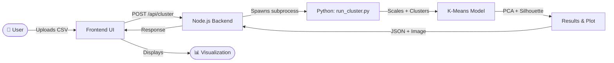

<div align="center">


# 🎯 OTT Audience Map

### *Unsupervised Machine Learning for Streaming Audience Segmentation*

> Upload a dataset. Cluster your audience. Visualize insights — all from the browser.

</div>

---

## 📌 Overview

**OTT Audience Map** is a full-stack Machine Learning mini project that segments OTT (Over-The-Top) streaming platform users into meaningful clusters using **K-Means clustering**. It bridges a **Node.js/Express backend**, a **Python ML pipeline**, and an interactive **frontend interface** to deliver end-to-end data analysis without needing any local ML setup.

Whether you're a data enthusiast or a developer exploring ML integration, this project provides a clean, working pipeline from raw CSV data to actionable audience segments.

---

## ✨ Features

| Feature | Description |
|---|---|
| 📁 **CSV Upload** | Upload any structured dataset directly from the browser |
| 🧮 **K-Means Clustering** | Automated clustering with configurable `k` values |
| 📉 **Dimensionality Reduction** | PCA applied for 2D visual projection of high-dimensional data |
| 📊 **Silhouette Analysis** | Cluster quality scoring to evaluate optimal segmentation |
| 🖼️ **PCA Plot Generation** | Matplotlib-generated cluster plots saved and served to frontend |
| 💾 **Downloadable Reports** | Export cluster assignments as CSV for further analysis |
| 🌐 **REST API** | Clean Express.js API connecting frontend to the Python engine |

---

## 🧠 Tech Stack

<div align="center">

| Layer | Technology |
|---|---|
| **Frontend** | HTML5, CSS3, Vanilla JavaScript |
| **Backend** | Node.js, Express.js |
| **ML Engine** | Python 3, scikit-learn, pandas, NumPy |
| **Visualization** | Matplotlib, PCA Scatter Plots |
| **Dev Tools** | VS Code, Git, GitHub |

</div>

---

## 🗂️ Project Structure

```
ML-mini-project/
│
├── 📂 backend/
│   ├── server.js              # Express server entry point
│   ├── routes/
│   │   └── cluster.js         # /api/cluster route handler
│   └── uploads/               # Temporarily stores uploaded CSVs
│
├── 📂 frontend/
│   ├── index.html             # Main UI page
│   ├── style.css              # Responsive styling
│   └── app.js                 # Fetch API calls & DOM manipulation
│
├── 📂 python/
│   ├── run_cluster.py         # Main ML script (KMeans + PCA + metrics)
│   └── requirements.txt       # Python dependencies
│
├── 📂 data/
│   └── sample_ott_data.csv    # Sample dataset for testing
│
├── .gitignore
└── README.md
```

---

## ⚙️ How It Works



### Step-by-Step Pipeline

1. **Upload** — User selects a `.csv` file through the browser interface
2. **Receive** — Express.js saves the file and invokes the Python script via `child_process`
3. **Process** — Python scales features, runs K-Means, applies PCA, computes silhouette scores
4. **Output** — Cluster labels, metrics JSON, and a PCA scatter plot are generated
5. **Display** — Frontend renders the cluster visualization and allows report download

---

## 🚀 Getting Started

### Prerequisites

- **Node.js** v16+ and **npm**
- **Python** 3.8+ with `pip`

### 1. Clone the Repository

```bash
git clone https://github.com/your-username/ott-audience-map.git
cd ott-audience-map
```

### 2. Install Backend Dependencies

```bash
cd backend
npm install
```

### 3. Install Python Dependencies

```bash
cd python
pip install -r requirements.txt
```

### 4. Start the Server

```bash
cd backend
node server.js
```

### 5. Open the App

```
http://localhost:3000
```

> Upload the sample CSV from `/data/sample_ott_data.csv` to try it instantly.

---

## 📊 Sample Output

```
Dataset loaded: 500 rows × 8 features
Features scaled using StandardScaler
Optimal k selected: 4 clusters
Silhouette Score: 0.62
PCA plot saved to: /outputs/cluster_plot.png
Cluster report saved to: /outputs/cluster_results.csv
```

---

## 📦 Python Requirements

```txt
scikit-learn>=1.2.0
pandas>=1.5.0
numpy>=1.23.0
matplotlib>=3.6.0
```

Install with:
```bash
pip install -r python/requirements.txt
```

---

## 🔮 Future Improvements

- [ ] Support for additional clustering algorithms (DBSCAN, Agglomerative)
- [ ] Elbow method chart for optimal `k` selection
- [ ] Interactive 3D PCA visualization using Plotly
- [ ] User authentication and saved session history
- [ ] Docker containerization for one-command deployment

---

## 🤝 Contributing

Contributions are welcome! Please follow these steps:

1. Fork the repository
2. Create a feature branch: `git checkout -b feature/your-feature`
3. Commit your changes: `git commit -m 'Add some feature'`
4. Push to the branch: `git push origin feature/your-feature`
5. Open a Pull Request

---

## 📄 License

This project is licensed under the **MIT License** — see the [LICENSE](LICENSE) file for details.

---
